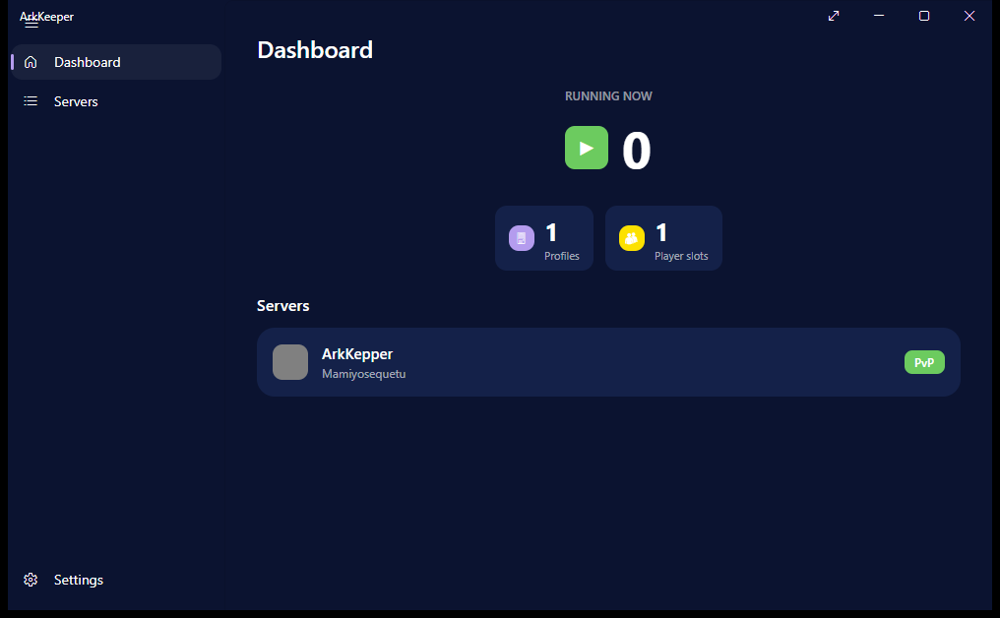
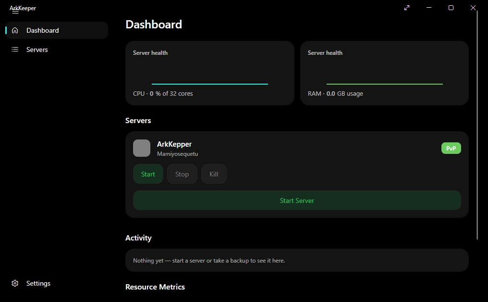
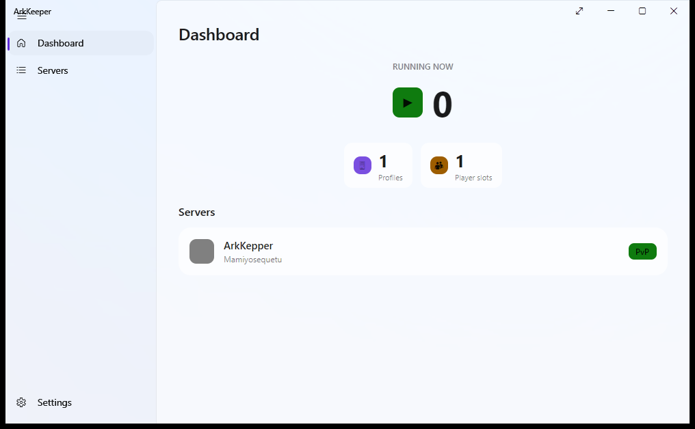
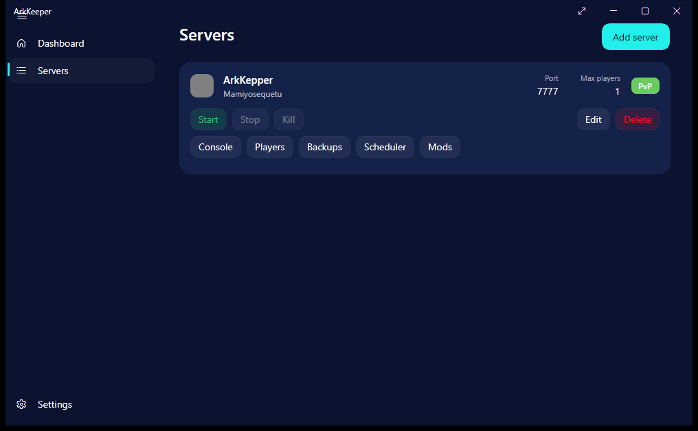
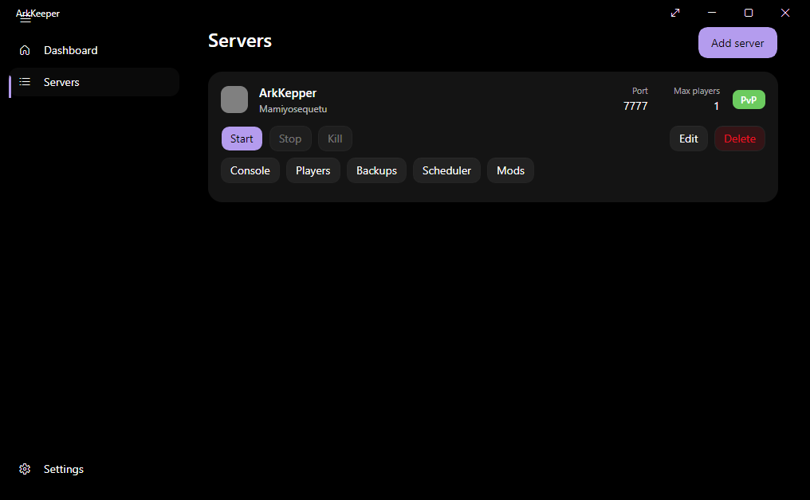
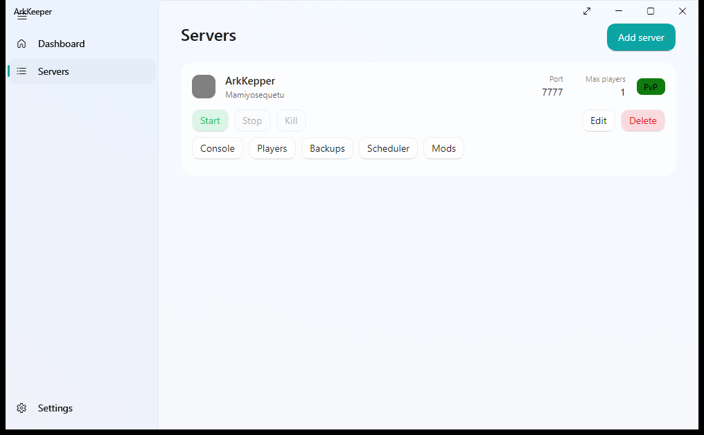
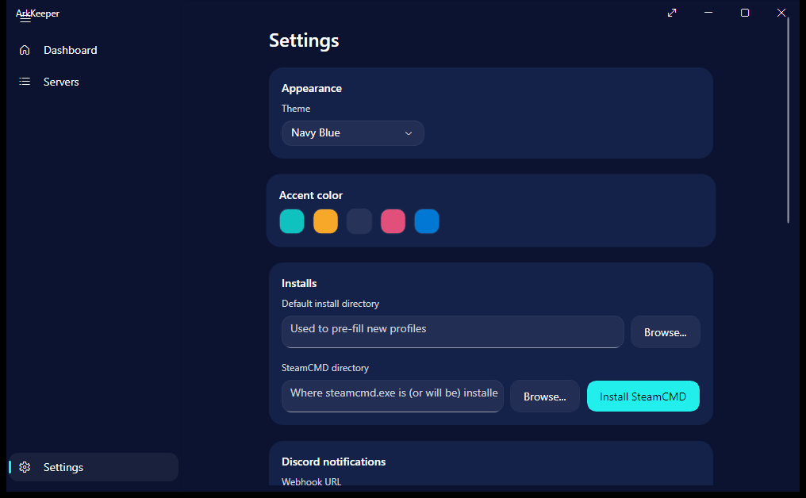

# ArkKeeper

[](https://github.com/Muurrcc/ArkKeeper/actions/workflows/build.yml)


ArkKeeper is a **modernization and optimization** of [ARK Server Manager](https://arkservermanager.freeforums.net/), the classic WPF/.NET Framework tool for administering dedicated *ARK: Survival Evolved* servers. It isn't an original project built from scratch: it's a rewrite of the same codebase — originally from [ChronosWS/ARK-Dedicated-Server-Tool](https://github.com/ChronosWS/ARK-Dedicated-Server-Tool) — on top of .NET 10 and Avalonia, with a modern interface (Mica, rounded corners, three built-in themes, accent colors) and cross-platform support built in from the design stage.

> **Legal notice:** ArkKeeper and its authors are not affiliated with Studio Wildcard or its partners. *ARK: Survival Evolved™* and its related images, trademarks, and rights are the exclusive property of Studio Wildcard and/or its affiliates. Free tool for legal use.

## Features

- **Server management** — create and edit any number of server profiles, covering all ~226 `GameUserSettings.ini`/`Game.ini` settings ARK exposes (rates & multipliers, rules, structures, taming, PvP, engrams, world/environment, chat, raw override lists), not just a curated subset. Settings are merged into the server's real config files rather than overwriting them, so manual edits and mod-added directives survive.
- **Real process control** — Start / Stop / Kill against the actual dedicated server process. Stop asks the server to save and exit gracefully over RCON first, falling back to a hard kill if RCON is unreachable or the timeout elapses.
- **Anti-cheat & performance** — toggle BattlEye off per server, and tune OS process priority and CPU core affinity without leaving the app.
- **RCON console** — send commands and watch the live response log.
- **Players and tribes** — connected-player list with kick/ban, known players and tribes parsed from save files.
- **Backups** — one-click world save/restore, optionally compressed.
- **Scheduler** — recurring or daily RCON tasks (e.g. `SaveWorld` every 6 hours) that keep running in the background.
- **Mods** — add Steam Workshop mod IDs and download/update them via SteamCMD.
- **Discord notifications** — server start/stop events posted to a webhook.
- **Auto-update** — checks a JSON manifest for new ArkKeeper releases and downloads them.
- **Three themes** — Light, OLED Black, and Navy Blue, plus five accent colors, switchable live from Settings.

## Screenshots

| Navy Blue | OLED Black | Light |
|---|---|---|
|  |  |  |
|  |  |  |

Theme picker in Settings:



## Installation

_(Pending until the first published release — in the meantime, build it yourself, see below)_

## Build from Source

Requirements: [.NET 10 SDK](https://dotnet.microsoft.com/download/dotnet/10.0)

```bash
git clone https://github.com/Muurrcc/ArkKeeper.git
cd ArkKeeper
dotnet build
dotnet run --project src/ArkKeeper.App
```

### Publishing an optimized build

```bash
# Requires .NET 10 installed on the target machine (~36 MB)
dotnet publish src/ArkKeeper.App -c Release -r win-x64 --self-contained false

# No .NET installation required (~113 MB, includes the runtime)
dotnet publish src/ArkKeeper.App -c Release -r win-x64 --self-contained true

# Same as above, but trimmed (~48 MB)
dotnet publish src/ArkKeeper.App -c Release -r win-x64 --self-contained true -p:PublishTrimmed=true
```

## Optimization

Compared to a generic `dotnet publish` (no RID), pinning the target to `win-x64` avoids bundling the native Skia/HarfBuzz binaries for *every* supported platform and strips native debug symbols that add nothing to a release build:

| Build | Size |
|---|---|
| Generic (`dotnet publish`, no RID) | 570 MB |
| `win-x64`, framework-dependent | **36 MB** |
| `win-x64`, self-contained (includes runtime) | 113 MB |
| `win-x64`, self-contained + trimmed | **48 MB** |

Startup time to visible window (framework-dependent, average of 3 measurements): **~656 ms**.

Trimming (`PublishTrimmed`) works end to end, verified by launching the published `.exe` — it took fixing two things first:

- **`ViewLocator`** resolved View↔ViewModel by reflection (`Type.GetType` with the name as a string); the trimmer removes types nothing references statically, so this broke in production ("Not Found: DashboardView"). Replaced with an explicit, reflection-free mapping.
- **`ServerProfile` serialization**: the `System.Text.Json` source generator doesn't see the properties `CommunityToolkit.Mvvm` generates from `[ObservableProperty]` — serializing it directly silently dropped almost all of the profile's data (found by inspecting the actual JSON, not from any warning or error). `ProfileStore` now serializes through `ServerProfileData`, a flat, hand-written snapshot built exactly for this — see the comment in that file.

With both fixes in place, `dotnet publish ... -p:PublishTrimmed=true` leaves no trimming warnings of its own (only two remain, neither ours: a low-risk one in the `.ini` engine from generic reflection, and one from FluentAvalonia's `DataGrid` control, which isn't even used yet).

## Tech stack

| Layer | Technology |
|---|---|
| UI | [Avalonia UI](https://avaloniaui.net/) + [FluentAvalonia](https://github.com/amwx/FluentAvalonia) |
| MVVM | [CommunityToolkit.Mvvm](https://github.com/CommunityToolkit/dotnet) |
| DI / Hosting | Microsoft.Extensions.Hosting |
| Logging | Microsoft.Extensions.Logging |
| Runtime | .NET 10 |

## Credits

Based on the original work by [ChronosWS](https://github.com/ChronosWS) and the [ARK Server Manager](https://arkservermanager.freeforums.net/) community, published under GPL-3.0.

## License

[GPL-3.0](LICENSE) — as a derivative of a GPL-3.0 project, ArkKeeper is distributed under the same terms: source code always available, and any fork or modification must remain open under this same license.
